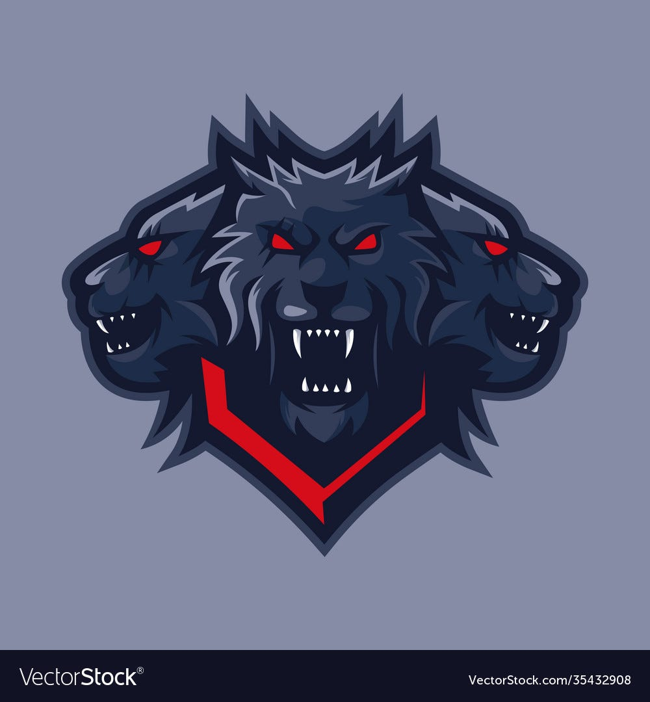

Welcome to **kerberos shop url** — your ultimate solution for enhancing your global commerce experience! 🌍 With a strong emphasis on **kerberos darknet url**, we deliver unparalleled worldwide shipping services, ensuring your products reach every corner of the globe with reliability and speed. Trust our platform's stellar reputation to elevate your business and expand your reach! 

## 🌟 Support for **kerberos shop url**

Need help? Our team is here to ensure your success with **kerberos shop url**! We offer round-the-clock professional support, so you're never alone in your journey. 😊

### Why Choose Us?
- **24/7 Availability**: Get assistance anytime, anywhere.  
- **Multiple Channels**: Reach us via email, chat, or phone—whatever suits you best.  
- **Quick Response Times**: We value your time and aim to resolve issues swiftly.  
- **Expert Assistance**: Our team of specialists is trained to handle all queries related to **kerberos darknet market url** and beyond.

### How It Works
Whether you're troubleshooting or seeking guidance, our reliable support system ensures a seamless experience. Don't hesitate to reach out—we’re committed to making **kerberos shop url** work effortlessly for you.  

Need more info? Click the buttons below to get started!

## Getting Started with **kerberos link**

Welcome to **kerberos link**, the easiest way to manage your finances securely and efficiently. Follow these steps to get started:

1. 📝 **Sign Up for an Account**  
   Begin by creating your account on **kerberos link**. Use a strong, unique password to ensure maximum security. For added protection, enable two-factor authentication (2FA) during the sign-up process.

   

2. 🔒 **Set Up Account Protection**  
   Enhance the security of your **kerberos link** account by configuring additional layers of protection. This includes setting up email alerts for suspicious activity and enabling biometric login options if available.

3. 💳 **Configure the Payment System**  
   Navigate to the **kerberos onion mirror** payment settings to link your preferred payment methods. Whether it’s a bank account or credit card, ensure all details are accurate and up-to-date. Verify your identity as prompted to complete the setup.

4. 🔄 **Initialize the Transaction System**  
   Once your payment methods are confirmed, you can start using the transaction system. Create your first transaction by selecting "New Transaction" from the dashboard. Review each step carefully to avoid errors.

   

5. 🛡️ **Monitor Your Activity**  
   Regularly check your transaction history to ensure everything aligns with your records. Use the built-in analytics tools in **kerberos link** to gain insights into your spending habits and optimize your financial health.

6. 🎯 **Explore Advanced Features**  
   Dive deeper into the platform by exploring advanced features such as automated savings plans, budget tracking, and customized alerts. These tools will help streamline your financial management.

---

Ready to take control of your finances? Click below to get started!

## 🛡️ Trust and Reliability with **kerberos darknet**

Welcome to the heart of what makes **kerberos darknet** a secure, reliable, and cutting-edge platform for all your financial needs. Here's how we ensure trust and reliability every step of the way:

---

### Advanced Platform Protection Measures 🔒

At **kerberos darknet**, security isn't just a feature—it's our foundation. Our advanced platform protection measures include state-of-the-art encryption protocols, multi-factor authentication (MFA), and real-time fraud detection systems. These safeguards are designed to keep your data secure and your transactions protected.

### Financial Privacy and Transaction Anonymity 🕶️

We understand the importance of keeping your financial activities private. With **kerberos darknet**, you enjoy robust privacy controls that allow you to maintain transaction anonymity while still benefiting from modern payment processing solutions. Your peace of mind is our priority!

---

### Modern Payment Processing 🚀

Say goodbye to outdated payment methods! **kerberos darknet** leverages the latest in payment technology, including **blockchain**, to offer seamless, fast, and secure transactions. Whether you're making a local purchase or conducting international business, our system ensures efficiency and reliability.

> Did you know? Blockchain technology enhances transparency and reduces the risk of fraud, making it a cornerstone of modern finance.

---

### Multi-Currency Support and Digital Assets (**kerberos onion mirror**) 💱

Our platform supports multiple currencies, giving you flexibility and convenience. But that's not all—**kerberos darknet** also embraces digital assets like **kerberos onion mirror**, empowering users to harness the power of decentralized finance. From traditional currencies to modern digital assets, we've got you covered.

### Decentralized Transaction Protection 🌐

Decentralization is at the core of our mission. By leveraging decentralized transaction protection, **kerberos darknet** minimizes single points of failure and enhances the overall security of your transactions. This approach ensures that your funds remain safe and accessible, no matter where you are in the world.

---

### Proven Track Record of Uptime and Availability ⏳

Reliability is key when it comes to financial platforms. **kerberos darknet** boasts an impressive track record of uptime and availability, ensuring that you can access your accounts and conduct transactions whenever you need to. Our commitment to excellence means fewer disruptions and more opportunities for you.

---

Ready to experience the future of finance with **kerberos darknet**? Join us today and take control of your financial journey with confidence!

